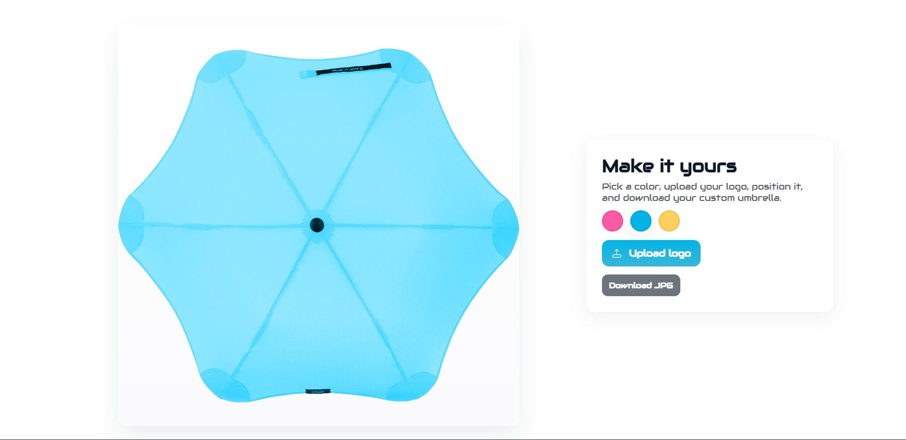
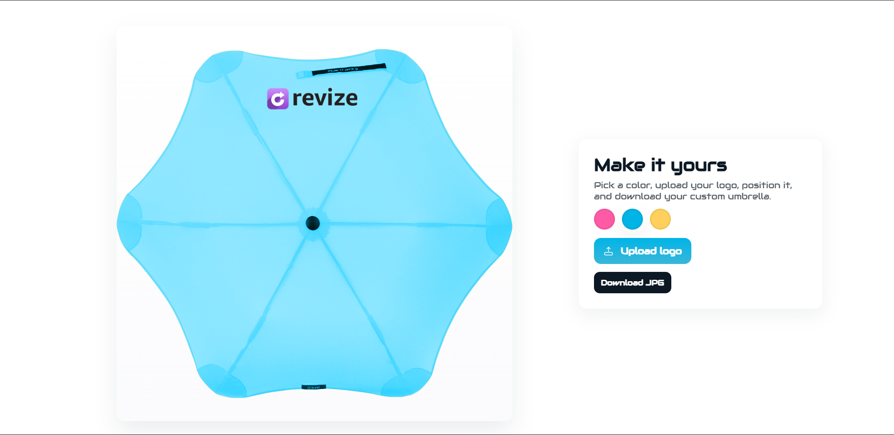
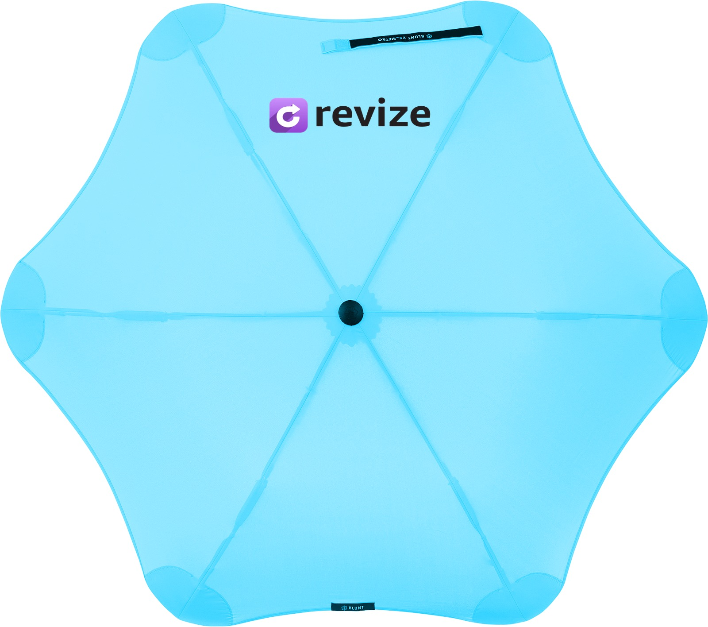

# ☂️ Umbrella Customizer

An interactive **umbrella customization tool** for corporate clients. This tool allows users to instantly preview their logo on an umbrella, choose from different colors, adjust the logo's position, and download a high-quality image of the final customized product.

---

## 🌟 Features

* 🎨 **Live Color Customization** – Instantly switch between **Pink**, **Blue**, and **Yellow** umbrellas with a live preview. (Default color: **Yellow** for high contrast by default.)
* 🖼️ **Dynamic Logo Upload** – Supports PNG and JPG files (up to 5MB). The logo is automatically scaled to fit the umbrella.
* 🖱️ **Drag & Position** – Easily move the uploaded logo anywhere on the umbrella canvas for perfect placement.
* 💾 **High-Quality Download** – Export the final design as a high-resolution **JPG image** with a clean white background.
* ⚡ **Smooth UI** – Features a loader animation, a minimal aesthetic, and a fully responsive layout for a seamless user experience.
* 🌈 **Realistic Recoloring** – Utilizes CSS **`mix-blend-mode: color`** to change umbrella colors while preserving the original fabric texture and lighting details.

---

## 🧠 Tech Stack

* **HTML5**, **CSS3**, and **Vanilla JavaScript**
* CSS **`mix-blend-mode: color`** for lifelike color application.
* **Canvas API** for rendering the final image and enabling high-quality downloads.

---

## 🚀 How to Run

1. Clone the repository:

```bash
git clone https://github.com/SamP231004/Umbrella-Customizer
cd Umbrella-Customizer
```

2. Place your base umbrella image in the project's root folder and name it exactly:

```
image.png
```

*(For best results, use a **transparent PNG** of your umbrella design. The base image should show the umbrella fabric and texture with the rest of the canvas transparent.)*

3. Open `index.html` in your web browser, either by using a command or by dragging the file into a browser window.

```bash
open index.html
```

---

## 🖼️ Screenshots

Here’s a preview of the **Umbrella Customizer** in action:

|                            Website Interface                            |                            Logo Uploaded                           |                            Downloaded Result                           |
| :---------------------------------------------------------------------: | :----------------------------------------------------------------: | :--------------------------------------------------------------------: |
|  |  |  |

* **SS_1.png** → The **Customizer Website UI**, showing the color options, upload button, and preview section.
* **SS_2.png** → The **Logo Uploaded** view, where a brand logo has been positioned on the umbrella.
* **SS_3.jpg** → The **Downloaded Result**, showing the exported, high-resolution umbrella image ready for use.

---

### 💡 Author

**Samarth Patel**
🔗 [Portfolio](https://github.com/SamP231004/Portfolio)
📧 [samp231004@gmail.com](mailto:samp231004@gmail.com)

---